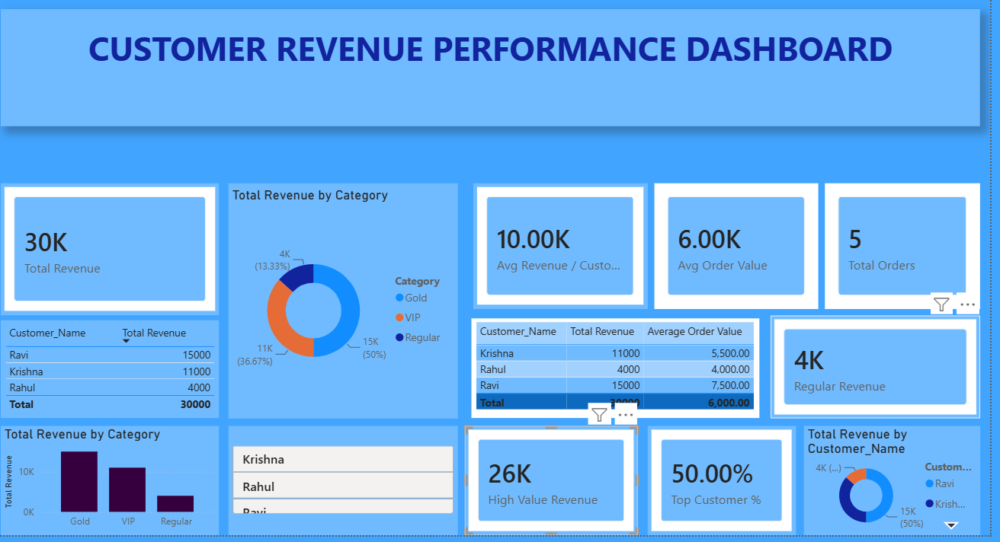

Save the following as **README.md** in your GitHub repository:

````md
# 📊 Customer Revenue Performance Dashboard

## 🚀 Project Overview

The Customer Revenue Performance Dashboard is an interactive Power BI project developed to analyze customer revenue, order performance, customer segmentation, and key business metrics.

This dashboard demonstrates practical Business Intelligence and Data Analytics skills using Power BI, DAX, Data Modeling, and Data Visualization techniques.

---

## 🎯 Business Objective

The goal of this project is to answer key business questions:

- Who are the top revenue-generating customers?
- Which customer category contributes the highest revenue?
- What is the average revenue generated per customer?
- What is the average order value?
- How much revenue comes from high-value customers?
- Which customer contributes the largest share of revenue?

---

## 🗂️ Dataset Files

### Customer_Data.xlsx

Contains customer information:

| Column |
|----------|
| Customer_ID |
| Customer_Name |
| Category |

Customer Categories:
- Gold
- VIP
- Regular

---

### sales_table.xlsx

Contains transaction details:

| Column |
|----------|
| Order_ID |
| Customer_ID |
| Product_ID |
| Revenue |

---

## 🔗 Data Model

Relationship created:

```text
Customers[Customer_ID]
        ↓
Sales[Customer_ID]
```

Relationship Type:

```text
One-to-Many (1:*)
```

---

## 📈 Dashboard KPIs

| KPI | Value |
|------|------|
| Total Revenue | 30K |
| Total Orders | 5 |
| Average Revenue Per Customer | 10K |
| Average Order Value | 6K |
| High Value Revenue | 26K |
| Top Customer Revenue Contribution | 50% |

---

## 📊 Dashboard Visualizations

### KPI Cards
- Total Revenue
- Total Orders
- Average Revenue Per Customer
- Average Order Value
- High Value Revenue
- Top Customer Revenue %

### Charts
- Revenue by Category (Donut Chart)
- Revenue by Customer (Donut Chart)
- Revenue by Category (Bar Chart)

### Tables
- Customer Revenue Summary
- Customer Order Analysis

### Filters
- Customer Name Slicer

---

## 🧮 DAX Measures Used

### Total Revenue

```DAX
Total Revenue =
SUM(Sales[Revenue])
```

### Total Orders

```DAX
Total Orders =
COUNT(Sales[Order_ID])
```

### Average Revenue Per Customer

```DAX
Average Revenue Per Customer =
DIVIDE(
    [Total Revenue],
    DISTINCTCOUNT(Customers[Customer_ID])
)
```

### Average Order Value

```DAX
Average Order Value =
DIVIDE(
    [Total Revenue],
    [Total Orders]
)
```

### Revenue Contribution %

```DAX
Revenue Contribution % =
DIVIDE(
    [Total Revenue],
    CALCULATE(
        [Total Revenue],
        ALL(Customers)
    )
)
```

---

## 📌 Key Insights

### Revenue by Customer

| Customer | Revenue |
|-----------|----------|
| Ravi | 15K |
| Krishna | 11K |
| Rahul | 4K |

### Revenue by Category

| Category | Revenue |
|------------|----------|
| Gold | 15K |
| VIP | 11K |
| Regular | 4K |

### Findings

✅ Gold customers generate the highest revenue.

✅ Ravi is the top-performing customer.

✅ High-value customers contribute approximately 87% of total revenue.

✅ Average revenue per customer is 10K.

✅ Average order value is 6K.

---

## 🛠️ Tools & Technologies

- Power BI Desktop
- DAX
- Data Modeling
- Microsoft Excel
- Data Visualization
- Business Intelligence

---

## 📂 Repository Structure

```text
├── Customer Quality Dashboard.pbix
├── Customer Revenue Performance Dashboard Report.pdf
├── sales_table.xlsx
├── Customer_Data.xlsx
├── Screenshot.png
└── README.md
```

---

## 📷 Dashboard Preview

Add your dashboard screenshot below:

```markdown

```

---

## 💡 Skills Demonstrated

- Power BI Dashboard Development
- Data Modeling
- DAX Calculations
- KPI Creation
- Customer Segmentation
- Revenue Analysis
- Business Intelligence Reporting
- Data Visualization

---

## 👨‍💻 Author

### Srinadhu Krishna Prabath

**Data Analyst | Power BI | SQL | Python | Excel**

🔗 LinkedIn:  
https://www.linkedin.com/in/srinadhukrishnaprabath

🔗 GitHub:  
https://github.com/krishnaprabath

---

